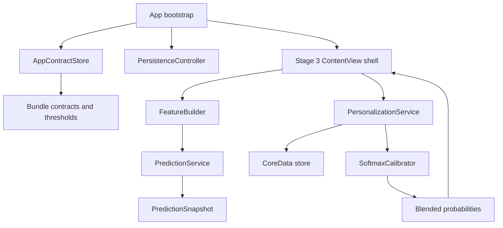
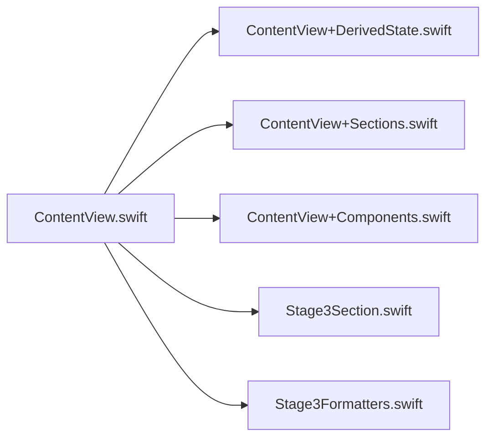

# Architecture Overview

## Purpose
This document explains how the iOS project is organized after the refactor and where the main runtime pieces live.

## Folder map
```text
course-work-ios/
├── App/
│   └── course_work_iosApp.swift
├── Core/
│   ├── AppContracts.swift
│   ├── AppRuntime.swift
│   ├── FeatureBuilder.swift
│   ├── PersonalizationService.swift
│   ├── Persistence.swift
│   └── PredictionService.swift
├── Features/
│   └── Stage3/
│       ├── ContentView.swift
│       ├── ContentView+Components.swift
│       ├── ContentView+DerivedState.swift
│       ├── ContentView+Sections.swift
│       ├── Stage3Formatters.swift
│       └── Stage3Section.swift
├── Resources/
│   └── Contracts/
│       ├── feature_contract.json
│       ├── thresholds.json
│       ├── release_manifest.json
│       ├── golden_inference_set_full_spend_tuned.json
│       └── berka_feature_passport_spend_bucket.md
├── course-work-iosTests/
│   ├── Unit/
│   ├── Smoke/
│   └── Support/
├── course-work-iosUITests/
└── Docs/
```

## Runtime flow




## Responsibilities
### App/
- Application entry point.
- Chooses persistent vs in-memory persistence.
- Injects the contract store into the UI.

### Core/
- `AppContracts.swift`: loads immutable bundle resources and validates availability.
- `FeatureBuilder.swift`: builds the 31-feature vector.
- `PredictionService.swift`: runs CoreML inference and normalizes vote counts.
- `PersonalizationService.swift`: stores labeled weeks and calibrates predictions.
- `Persistence.swift`: CoreData stack, preview seed, and store creation.
- `AppRuntime.swift`: runtime helpers for test detection and launch behavior.

### Features/
- User-facing stage-3 screen and demo controls.
- The UI is diagnostic-first by design because the project stops at Stage 3.
- The stage-3 UI is split into a thin shell plus derived state, section composition, and shared components.

### Resources/
- Frozen contract files used at runtime.
- The app should not derive thresholds or label mapping from user data.

### Tests/
- `Unit/`: fast logic and contract checks.
- `Smoke/`: calibration harness and longer-running verification.
- `Support/`: reusable fixtures and smoke helpers.

## Data model
The current CoreData model is intentionally small:
- `WeeklyRecord`
- `PredictionSnapshot`
- `CalibrationStateRecord`

## Important invariants
- Feature order is frozen.
- Thresholds are train-derived and frozen.
- RF `classProbability` is a vote-count dictionary and must be normalized.
- Calibration uses the normalized RF probabilities, not raw votes.
- The app is designed to be fully local and offline.
